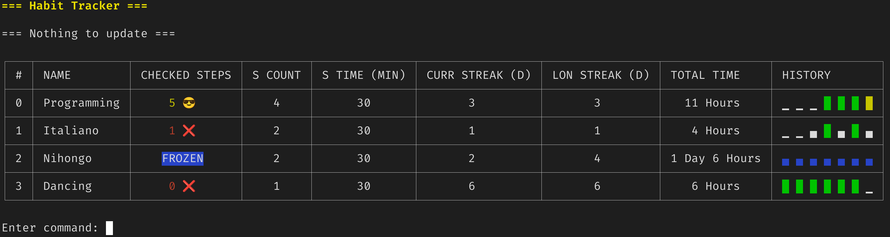

# habit-tracker-go

<!-- ABOUT THE PROJECT -->

## About The Project

Created partially to familiarize myself with the Go programming language and to track time of my own daily routines.

Key features:

- Creating a habit by providing a number of daily intervals and their time.
- Tracking daily time spent on a habit.
- Checking whether the daily objective has been fulfilled. Has a user done less/more than the desired objective.
- Allowing to freeze a habit when a user has currently no time for it due to real life obligations.

When the application is executed and a day or more have passed the data is recalculated.
All of the data is stored in a json file and can be displayed in a tabular form.



### Commands

```
 p   [index?]                           Print all habits / a habit
 a   [name] [stepsCount] [stepMinutes]  Add a habit
 d   [index]                            Delete a habit
 ct  [index] [stepMinutes]              Change step time in minutes of a habit
 cs  [index] [stepsCount]               Change number of steps
 f   [index]?                           Freeze all habits / a habit
 uf  [index]?                           Unfreeze all habits / a habit
 q                                      Quit
```

### todo

- Investigate Union Types in go (Entry object)
- Better commands handling (avoid repetition)
